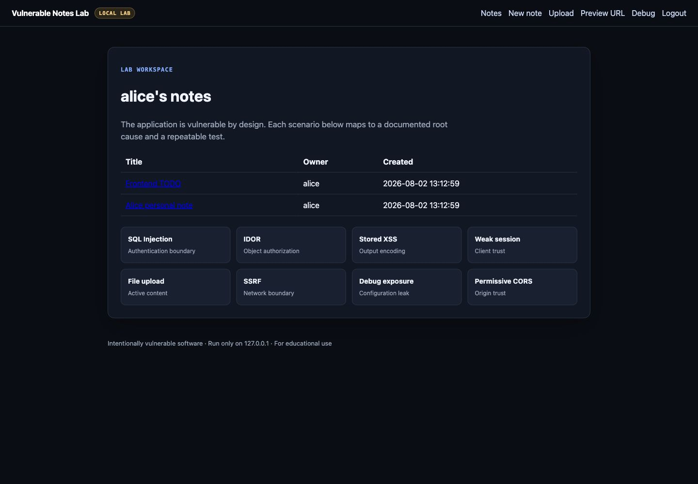

# Vulnerable Notes Lab

[](https://github.com/fant3k/vulnerable-notes-lab/actions/workflows/tests.yml)


[](LICENSE)

[Русская версия](README.md)

Vulnerable Notes Lab is a deliberately vulnerable local web application for
reproducing common web-security failures and studying their root causes.

The application models a small notes service with authentication, private
notes, attachments and URL previews. Eight intentionally isolated scenarios
are documented and verified by automated tests.

> Run this application on `127.0.0.1` or in an isolated training environment.
> Never expose it to the internet.



The screenshot comes from the real application running locally. It contains
demo data only—no real credentials, secrets or user information.

## Lab scenarios

| Scenario | Security boundary |
|---|---|
| SQL Injection | Untrusted form input reaches a SQL interpreter |
| IDOR | Note lookup does not enforce object ownership |
| Stored XSS | Stored note content reaches an HTML sink |
| Weak session | The server trusts an unsigned client-side identity |
| Insecure file upload | Active HTML is served from the application origin |
| SSRF | User-controlled URLs cross the server network boundary |
| Debug exposure | Internal configuration is available to regular users |
| Permissive CORS | Arbitrary origins receive credentialed access |

Every scenario has Russian and English writeups covering reproduction, root
cause, realistic impact and remediation.

## Quick start

```bash
python3 -m venv .venv
source .venv/bin/activate
pip install -r requirements.txt
scripts/reset_db.sh
scripts/run.sh
```

Open `http://127.0.0.1:8090` and use one of the demo accounts:

```text
alice / password123
bob   / qwerty
admin / admin123
```

Docker Compose is also supported:

```bash
docker compose up --build
```

The Compose configuration publishes the lab on localhost only.

## Verification

```bash
scripts/test.sh
```

Unit tests cover the database and session primitives. HTTP integration tests
start the real server and verify all eight documented scenarios, including the
same-process SSRF flow and multipart upload.

The current verified release is `v1.0.0`. The suite contains 16 tests, including
HTTP reproduction of every advertised scenario.

## Repository map

```text
app.py                  entrypoint
vuln_notes/             HTTP, database, sessions and templates
tests/                  unit and end-to-end HTTP tests
docs/writeups/ru/       Russian security writeups
docs/writeups/en/       English security writeups
docs/LAB_DESIGN.md      scenario boundaries and guardrails
Dockerfile              non-root container image
docker-compose.yml      localhost-only container launch
```

## Design constraints

The lab is intentionally unsafe, but unrelated behavior is kept out of each
exercise. For example, the IDOR lookup uses a parameterized query so the case
demonstrates authorization failure without adding a second SQL Injection.
Uploads are size-limited and filenames are normalized so the upload exercise
does not accidentally become path traversal or disk exhaustion.

See [docs/LAB_DESIGN.md](docs/LAB_DESIGN.md) for the complete scenario contract.

## Ethics

Use this repository only for local education, defensive testing and secure-code
review practice. It is not a production application template.

## License

[MIT](LICENSE). The license permits reuse of the code; it does not make this
intentionally vulnerable application safe to expose to public networks.
